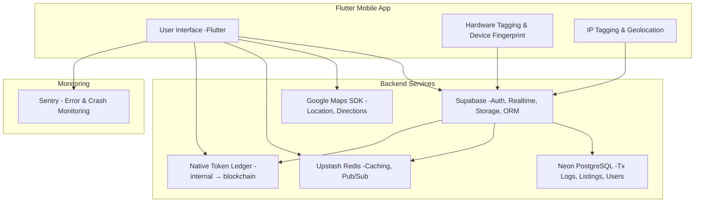

# 🌐 TabL

> A decentralized super-app built with Flutter — combining a multi-service marketplace, ride-sharing, rentals, food services, voting, community news, and a native token economy.

---

## 🎯 Vision
TabL is designed to:
- Empower users to **offer and consume peer-to-peer services**: rides, deliveries, rentals, tiffin, etc.
- **Verify and onboard** new users in a decentralized, community-driven way.
- Introduce a **native token** for payments, rewards, and voting.
- Deliver **real-time, community-driven news**.
- Prevent fraud through **hardware tagging, IP tagging, and an immutable transaction chain**.

---

## 🚀 Tech Stack

| Area         | Technology                          |
| ------------ | ----------------------------------- |
| UI           | Flutter                             |
| Auth         | Supabase OAuth                      |
| Backend DB   | Neon (PostgreSQL) + Supabase ORM    |
| Realtime     | Supabase Realtime + Upstash Redis   |
| Native Token | Internal ledger → planned blockchain|
| Maps         | Google Maps SDK                     |
| Storage      | Supabase Storage                    |
| Monitoring   | Sentry                              |
| Anti-fraud   | Device fingerprinting, IP tagging   |

---

## 🧩 Key Features

- ✅ Multi-service marketplace (rides, rentals, food, delivery, etc.)
- ✅ Users can act as providers & consumers
- ✅ Decentralized user verification & referral system
- ✅ Native token for payments, rewards, and governance
- ✅ Voting & proposal system
- ✅ Real-time community news
- ✅ Hardware/IP tagging & immutable transaction logs for fraud prevention

---

## 📦 Project Structure (proposed)

```plaintext
lib/
├── main.dart
├── core/                  # Shared services, constants, utils, theming
├── features/              # Modular, feature-first design
│   ├── auth/              # Sign up, login, decentralized verification
│   ├── marketplace/       # Service listing & booking flows
│   ├── ridesharing/       # Ride-sharing module
│   ├── rentals/           # Home rentals listing
│   ├── food/              # Tiffin & restaurant services
│   ├── wallet/            # Native token management
│   ├── voting/            # Community proposals & governance
│   ├── news/              # News & announcements
│   └── transactions/      # Immutable transaction chain & logs
├── models/                # Data models
├── blocs/ or cubits/      # State management
├── ui/                    # Common screens, widgets, components
└── services/              # External integrations (maps, storage, API)

> 🧪 Follows a feature-first structure for scalability & modularity.

```
---

## 📈 Development Path

See: 📄 [Development Plan & Roadmap](docs/DEVELOPMENT_PLAN.md)

---

## 🛠 Architecture Diagram

---

## 🤝 Contributing

1. Clone the repository:

git clone https://github.com/your-org/tabl.git


2. Install dependencies:

flutter pub get


3. Run the app:

flutter run


4. Create a feature branch:

git checkout -b feat/my-feature


5. Commit, push, and open a pull request.


> Please follow the guidelines in CONTRIBUTING.md.


---

## 🛡 Security & Privacy

Decentralized verification by trusted users

Encrypted storage for KYC data

Hardware tagging & IP tagging to detect duplicate or fake accounts

Immutable transaction logs to ensure transparency


---

## 🧠 License

MIT (or another license of your choice)


---

Built with ❤️ using Flutter, Supabase, Neon, Upstash, Sentry, and open-source spirit.

---
