# 🌐 TabL

> A decentralized super-app built with Flutter — combining a multi-service marketplace, ride-sharing, rentals, food services, voting, community news, and a native token economy.

---

## 🎯 Vision
TabL is designed to:
- Empower users to **offer and consume peer-to-peer services**: rides, deliveries, rentals, tiffin, etc.
- **Verify and onboard** new users in a decentralized, community-driven way.
- Introduce a **native token** for payments, rewards, and voting.
- Deliver **real-time, community-driven news**.
- Prevent fraud through **hardware tagging, IP tagging, and an immutable transaction chain**.

---

## 🚀 Tech Stack

| Area         | Technology                          |
| ------------ | ----------------------------------- |
| UI           | Flutter                             |
| Auth         | Supabase OAuth                      |
| Backend DB   | Neon (PostgreSQL) + Supabase ORM    |
| Realtime     | Supabase Realtime + Upstash Redis   |
| Native Token | Internal ledger → planned blockchain|
| Maps         | Google Maps SDK                     |
| Storage      | Supabase Storage                    |
| Monitoring   | Sentry                              |
| Anti-fraud   | Device fingerprinting, IP tagging   |

---

## 🧩 Key Features

### Implemented ✅
- **Authentication System**: Google OAuth and email/password auth with Supabase
- **User Profile Management**: Complete CRUD operations for user profiles
  - View profile with avatar, bio, and contact info
  - Edit profile with form validation
  - Secure logout functionality
  - Automatic profile creation on signup
- **Clean Architecture**: Feature-first structure with separation of concerns
- **State Management**: BLoC pattern for predictable state updates
- **Security**: Row Level Security (RLS) and secure data access
- **Modern UI**: Glass morphism design with dark theme

### Planned 🚧
- Multi-service marketplace (rides, rentals, food, delivery, etc.)
- Users can act as providers & consumers
- Decentralized user verification & referral system
- Native token for payments, rewards, and governance
- Voting & proposal system
- Real-time community news
- Hardware/IP tagging & immutable transaction logs for fraud prevention

---

## 📦 Current Project Structure

```plaintext
lib/
├── main.dart                  # App entry point with DI setup
├── auth_gate.dart             # Auth state controller
├── core/                      # Shared services, constants, theming
│   ├── services/              # Singleton services (auth, storage)
│   └── theme/                 # App-wide theming
├── features/                  # Feature-first modular design
│   ├── auth/                  # ✅ Authentication (complete)
│   │   ├── data/              # Repository implementation
│   │   ├── domain/            # Business logic & interfaces
│   │   └── presentation/      # UI & BLoC
│   ├── profile/               # ✅ Profile management (complete)
│   │   ├── data/              # Repository implementation
│   │   ├── domain/            # Business logic & interfaces
│   │   └── presentation/      # UI & BLoC
│   ├── home/                  # 🚧 Home screen (placeholder)
│   ├── search/                # 🚧 Search feature (placeholder)
│   ├── connect/               # 🚧 Connect feature (placeholder)
│   └── shell/                 # Main navigation shell
└── shared/                    # Reusable UI components
    └── widgets/               # Glass containers, buttons, forms

docs/
├── dev/                       # Developer documentation
│   ├── architecture.md        # Architecture guide
│   ├── auth/                  # Auth feature docs
│   ├── profile/               # Profile feature docs
│   └── theming.md             # UI theming guide
├── DATABASE_SETUP.md          # Database migration guide
└── ISSUES_AND_IMPROVEMENTS.md # Issues fixed & improvements

> 🏗️ Clean architecture with feature-first structure for scalability & modularity.
```
---

## 📈 Development Path

See: 📄 [Development Plan & Roadmap](docs/DEVELOPMENT_PLAN.md)

---

## 🛠 Architecture Diagram

```mermaid
flowchart TD
  subgraph Client[Flutter Mobile App]
    direction TB
    UI[User Interface -Flutter]
    DeviceTag[Hardware Tagging & Device Fingerprint]
    IPTag[IP Tagging & Geolocation]
  end

  subgraph Backend[Backend Services]
    direction TB
    Supabase[Supabase -Auth, Realtime, Storage, ORM]
    Neon[Neon PostgreSQL -Tx Logs, Listings, Users]
    Redis[Upstash Redis -Caching, Pub/Sub]
    Maps[Google Maps SDK -Location, Directions]
    Token[Native Token Ledger -internal → blockchain]
  end

  subgraph Monitoring
    Sentry[Sentry - Error & Crash Monitoring]
  end

  %% Connections
  UI --> Supabase
  UI --> Maps
  UI --> Redis
  UI --> Token
  DeviceTag --> Supabase
  IPTag --> Supabase
  Supabase --> Neon
  Supabase --> Redis
  Supabase --> Token
  UI --> Sentry
```

---

## 🤝 Contributing

### Setup Instructions

1. **Clone the repository**:
```bash
git clone https://github.com/Harshit16g/thread.git
cd thread
```

2. **Install dependencies**:
```bash
flutter pub get
```

3. **Set up environment variables**:
Create a `.env` file in the root directory:
```env
SUPABASE_URL=your_supabase_url
SUPABASE_ANON_KEY=your_supabase_anon_key
GOOGLE_WEB_CLIENT_ID=your_google_web_client_id
APP_REDIRECT_URI=your_app_redirect_uri
```

4. **Set up the database**:
Follow the instructions in [docs/DATABASE_SETUP.md](docs/DATABASE_SETUP.md) to create the database schema.

5. **Run the app**:
```bash
flutter run
```

6. **Create a feature branch**:
```bash
git checkout -b feat/my-feature
```

7. **Commit, push, and open a pull request**.

### Documentation
- [Architecture Guide](docs/dev/architecture.md)
- [Auth Feature](docs/dev/auth/frontend.md)
- [Profile Feature](docs/dev/profile/feature.md)
- [Database Setup](docs/DATABASE_SETUP.md)
- [Issues & Improvements](docs/ISSUES_AND_IMPROVEMENTS.md)

> Please follow the guidelines in [CONTRIBUTING.md](docs/Contribution.md)


---

## 🛡 Security & Privacy

Decentralized verification by trusted users

Encrypted storage for KYC data

Hardware tagging & IP tagging to detect duplicate or fake accounts

Immutable transaction logs to ensure transparency


---

## 🧠 License

MIT (or another license of your choice)


---

Built with ❤️ using Flutter, Supabase, Neon, Upstash, Sentry, and open-source spirit.

---
