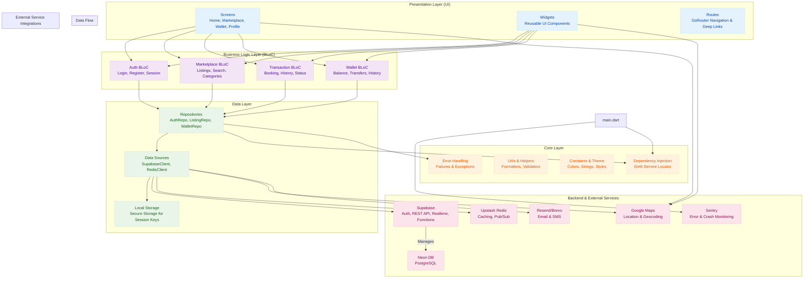

# TabL: Application Architecture & Design
*Version 1.1, January 2025*

---

### **Table of Contents**
1.  [**Introduction**](#1-introduction)
2.  [**System Architecture Overview**](#2-system-architecture-overview)
3.  [**Technology Stack**](#3-technology-stack)
4.  [**Flutter Frontend Architecture**](#4-flutter-frontend-architecture)
5.  [**Data & API Layer Design**](#5-data--api-layer-design)
6.  [**Core Feature Flow: Peer-to-Peer Service**](#6-core-feature-flow-peer-to-peer-service)
7.  [**Environment & Deployment Strategy**](#7-environment--deployment-strategy)

---

## 1. Introduction
This document presents the comprehensive architecture for **TabL**, a decentralized super-app built with Flutter. As outlined in the project vision, TabL is designed to empower users to offer and consume peer-to-peer services, manage community news, and participate in a token economy, all while ensuring security through hardware and IP tagging.

This architecture prioritizes a **simple, scalable, and developer-friendly** workflow by leveraging a modern BaaS (Backend-as-a-Service) approach with Supabase, while maintaining a clean, feature-first structure on the frontend.

## 2. System Architecture Overview
The system follows a clean, layered architecture that separates concerns and promotes maintainability. Unlike a complex microservices setup, we will use a **Supabase-first approach**, where the Supabase platform acts as our primary backend, significantly simplifying development and infrastructure management.



## 3. Technology Stack
- **Frontend**: Flutter (Latest Stable)
- **State Management**: BLoC (`flutter_bloc`, `equatable`)
- **Dependency Injection**: GetIt (`get_it`)
- **Routing**: GoRouter (`go_router`)
- **Backend-as-a-Service**: Supabase (`supabase_flutter`)
- **Database**: Neon PostgreSQL (managed via Supabase)
- **Caching**: Upstash Redis
- **Email/SMS**: Resend (Transactional), Brevo (Marketing)
- **Error Monitoring**: Sentry (`sentry_flutter`)
- **Location**: Google Maps SDK

## 4. Flutter Frontend Architecture
We will strictly follow the existing **feature-first** project structure, which is perfect for scalability and team collaboration.

- **`lib/core`**: Contains shared app-wide logic. This is where `AppConfig`, `Sentry`, and `GetIt` setup will live.
- **`lib/features`**: Each feature (e.g., `auth`, `marketplace`, `wallet`) is a self-contained module with its own `data`, `domain`, and `presentation` layers.
- **`lib/shared`**: Contains purely presentational widgets that are used across multiple features (e.g., `PrimaryButton`, `AvatarGlow`).

#### BLoC State Management
Each feature will have one or more BLoCs responsible for managing its state. The flow is unidirectional and predictable:
1.  **Event**: The UI dispatches an event (e.g., `LoginButtonPressed`).
2.  **BLoC**: The BLoC receives the event, calls one or more methods on its repository dependency, and handles business logic.
3.  **State**: Based on the result, the BLoC emits a new state (e.g., `AuthLoading`, `AuthSuccess`, `AuthFailure`).
4.  **UI**: The `BlocBuilder` widgets listen to the state changes and rebuild themselves accordingly.

## 5. Data & API Layer Design
To maintain simplicity and speed, we will **not** build a separate GraphQL or REST API server. We will leverage Supabase's powerful, auto-generated APIs.

#### Supabase Client (Primary Data Source)
The `supabase_flutter` SDK will be our primary tool for interacting with the backend.

- **Standard Operations (CRUD)**: For creating, reading, updating, or deleting data, we will use the standard Supabase query builder.
  - **Example**: Fetching listings from a repository implementation.
    ```dart
    // In ListingRepositoryImpl
    final response = await supabaseClient
        .from('listings')
        .select('*')
        .eq('is_available', true)
        .order('created_at', ascending: false);
    ```
- **Complex Business Logic**: For operations that require complex validation or multiple steps (e.g., processing a transaction), we will write **PostgreSQL Functions (RPCs)** in the Supabase dashboard.
  - **Example**: Defining and calling a function to complete a transaction.
    - **SQL Function**:
      ```sql
      -- in Supabase SQL Editor
      CREATE OR REPLACE FUNCTION complete_transaction(transaction_id UUID)
      RETURNS VOID AS $$
      BEGIN
        -- 1. Update the transaction status
        UPDATE transactions SET status = 'completed' WHERE id = transaction_id;
        -- 2. Update the provider's reputation score
        UPDATE users SET reputation_score = reputation_score + 10 WHERE id = (SELECT provider_id FROM transactions WHERE id = transaction_id);
      END;
      $$ LANGUAGE plpgsql;
      ```
    - **Flutter Call**:
      ```dart
      // In TransactionRepositoryImpl
      await supabaseClient.rpc('complete_transaction', params: {'transaction_id': '...'});
      ```

#### Redis Client (Caching)
For performance-critical data that is read frequently but updated less often (e.g., user profiles, popular service listings), repositories will implement a caching layer using Redis.

## 6. Core Feature Flow: Peer-to-Peer Service
This example illustrates how all the layers work together when a user books a service.
1.  **UI (`ListingDetailsScreen`)**: The user taps the "Book Now" button, triggering `context.read<TransactionBloc>().add(TransactionCreateRequested(listingId: '...'))`.
2.  **BLoC (`TransactionBloc`)**: Receives the event, emits `TransactionInProgress` state, and calls `_transactionRepository.createTransaction(...)`.
3.  **Repository (`TransactionRepositoryImpl`)**: Calls the Supabase client: `await supabaseClient.from('transactions').insert({...})`.
4.  **Real-time Update**: The service provider's app, subscribed to changes on the `transactions` table via Supabase Realtime, receives a new transaction and shows a notification.
5.  **Completion**: When the service is done, the provider's app calls `context.read<TransactionBloc>().add(TransactionCompleteRequested(transactionId: '...'))`.
6.  **RPC Call**: The BLoC triggers the repository, which calls the `complete_transaction` RPC to atomically update the transaction status and the provider's reputation score.

## 7. Environment & Deployment Strategy
We will use a simple and effective environment management strategy to ensure safety and ease of development.

- **Environment Files**:
  - `.env.dev`: Contains keys for the development Supabase project.
  - `.env.prod`: Contains keys for the live production Supabase project.
- **Configuration Loading**: We will use a centralized `AppConfig` class, populated at startup using `String.fromEnvironment()`. This avoids scattering environment logic throughout the app.
- **Build Commands**:
  - **Development**: `flutter run --dart-define-from-file=.env.dev`
  - **Production**: `flutter build apk --dart-define-from-file=.env.prod`

This architecture provides a robust, scalable, and developer-friendly foundation for building TabL, allowing for rapid feature development while ensuring long-term maintainability.
