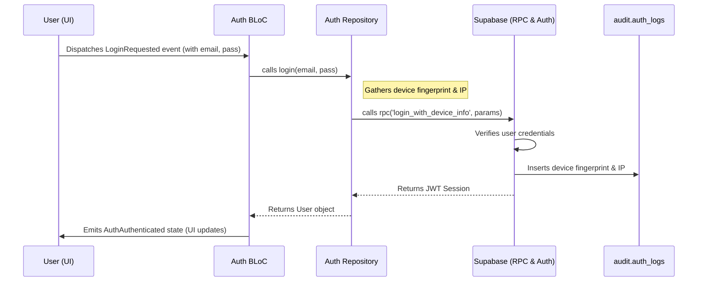

# TabL: Detailed Authentication Flow
*Version 1.0, January 2025*

---

## 1. Introduction
This document provides a comprehensive, end-to-end guide to the authentication system in the TabL application. It covers the frontend (Flutter BLoC), the backend (Supabase), and the critical security mechanisms that protect our users.

This is a deep-dive implementation guide based on the **[Security Model](../SECURITY_MODEL.md)** and the **[API Design](../API_DESIGN.md)** documents.

## 2. Authentication Flow Overview
The authentication flow is designed to be secure and seamless. It uses a standard BLoC pattern on the frontend and leverages Supabase's built-in authentication, extended with our custom security features.



## 3. Frontend Implementation (Flutter BLoC)

The entire authentication flow on the client-side is managed within the `lib/features/auth/` directory, following our clean architecture pattern.

### 3.1. Presentation Layer
-   **`AuthScreen`**: The primary UI for login and registration. It dispatches events like `LoginRequested` or `RegisterRequested` to the `AuthBloc`.
-   **`AuthBloc`**:
    -   Receives authentication events from the UI.
    -   Calls the appropriate methods on the `AuthRepository`.
    -   Emits states (`AuthInitial`, `AuthLoading`, `AuthAuthenticated`, `AuthUnauthenticated`, `AuthFailure`) to the UI to reflect the current state of the authentication process.
    -   **Example `_onLoginRequested` handler**:
        ```dart
        // In lib/features/auth/presentation/bloc/auth_bloc.dart
        Future<void> _onLoginRequested(
          LoginRequested event,
          Emitter<AuthState> emit,
        ) async {
          emit(AuthLoading());
          final result = await _authRepository.login(
            email: event.email,
            password: event.password,
          );
          result.fold(
            (failure) => emit(AuthFailure(message: failure.message)),
            (user) => emit(AuthAuthenticated(user: user)),
          );
        }
        ```

### 3.2. Domain Layer
-   **`AuthRepository` (Interface)**: The contract that the `AuthBloc` depends on. This decouples our business logic from the Supabase implementation.
    ```dart
    // In lib/features/auth/domain/repositories/auth_repository.dart
    abstract class AuthRepository {
      Future<Either<Failure, User>> login({
        required String email,
        required String password,
      });
      // ... other methods for register, logout, etc.
    }
    ```

### 3.3. Data Layer
-   **`AuthRepositoryImpl`**: The concrete implementation of the `AuthRepository`. This is where all the Supabase-specific code lives.
-   **`DeviceFingerprintDataSource`**: A dedicated data source responsible for collecting the device ID and IP address. The `AuthRepositoryImpl` will call this data source before making the login request to Supabase.
    ```dart
    // In lib/features/auth/data/repositories/auth_repository_impl.dart
    @override
    Future<Either<Failure, User>> login({
      required String email,
      required String password,
    }) async {
      try {
        final deviceId = await _deviceFingerprintDataSource.getDeviceId();
        
        final response = await _supabaseClient.rpc('login_with_device_info', params: {
          'user_email': email,
          'user_password': password,
          'device_id': deviceId,
        });

        // Convert the RPC response to a User entity
        final user = UserModel.fromJson(response).toEntity();
        return Right(user);

      } on AuthException catch (e) {
        return Left(AuthFailure(message: e.message));
      }
    }
    ```

## 4. Backend Implementation (Supabase)

### 4.1. `login_with_device_info` RPC Function
This is the cornerstone of our secure authentication flow. It is a PostgreSQL function created in the Supabase SQL Editor.

-   **Security**: This function is defined with `SECURITY DEFINER` to allow it to temporarily bypass RLS to write to the `audit.auth_logs` table.
-   **Logic**:
    1.  It takes the user's email, password, and device ID as arguments.
    2.  It attempts to authenticate the user against the `auth.users` table.
    3.  If authentication is successful, it inserts a new row into the `audit.auth_logs` table, which includes the `user_id`, the `device_id`, and the `inet_client_addr()` (the request's IP address).
    4.  It returns the user's profile and a new JWT session token.

### 4.2. Row-Level Security (RLS) Policies
RLS policies are critical for ensuring users can only access data they are permitted to.

-   **`users` table**:
    -   `SELECT`: Any authenticated user can select any user's public profile.
    -   `UPDATE`: A user can only update their own profile (`id = auth.uid()`).
-   **`audit.auth_logs` table**:
    -   **No public access.** RLS policies are configured to block all `SELECT`, `INSERT`, `UPDATE`, and `DELETE` operations from the public API. Only `SECURITY DEFINER` functions can access this table.

This end-to-end flow ensures that our authentication system is not only functional but also deeply integrated with our proactive security model from the very first user interaction.
