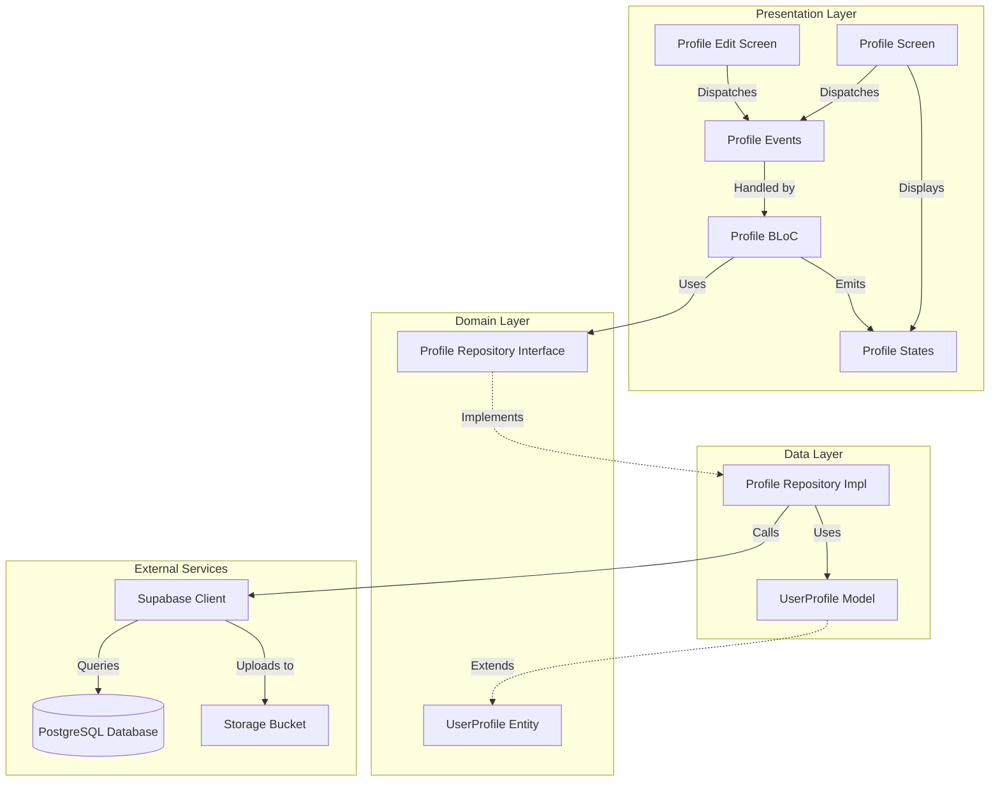
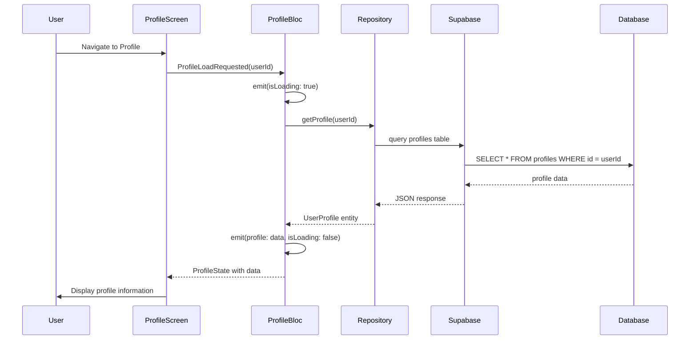
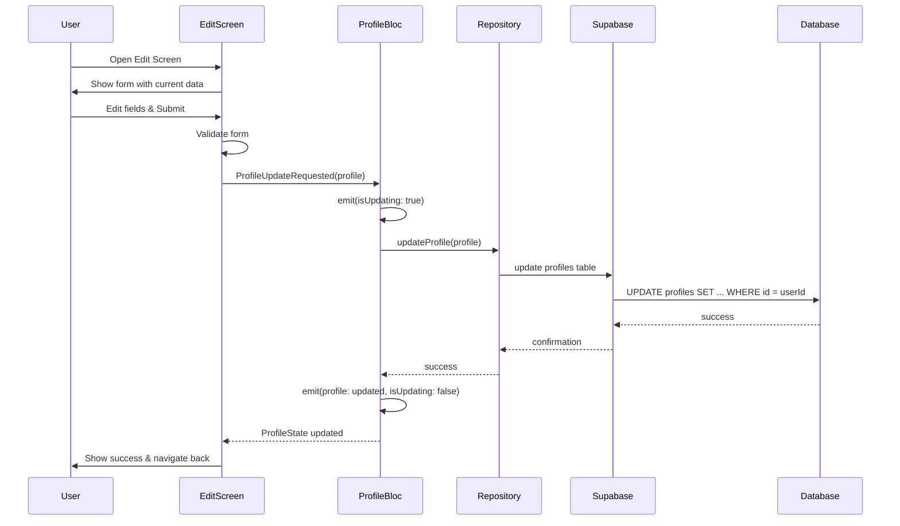
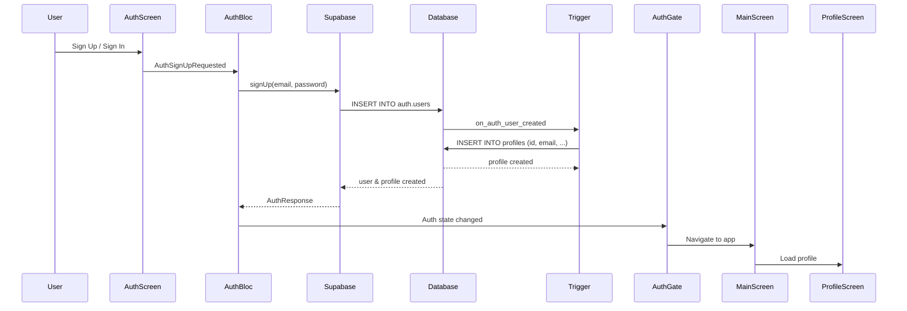
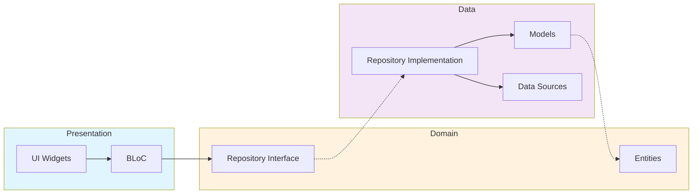
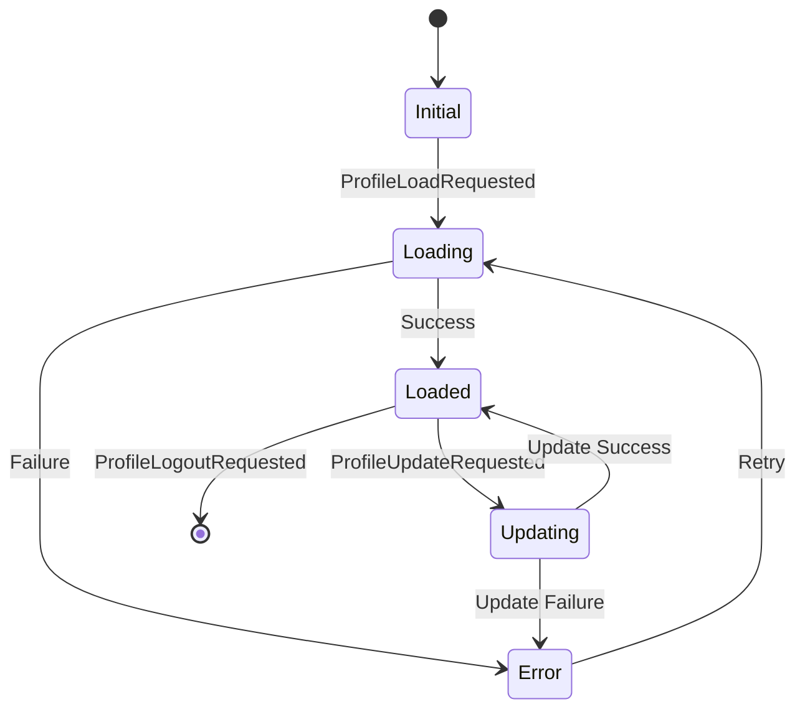
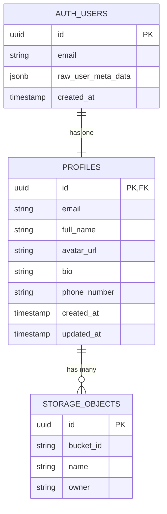
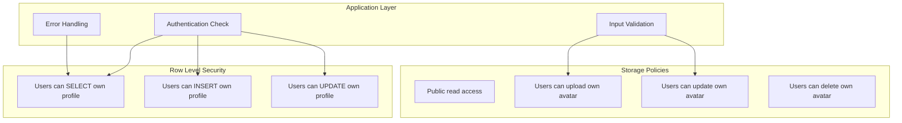
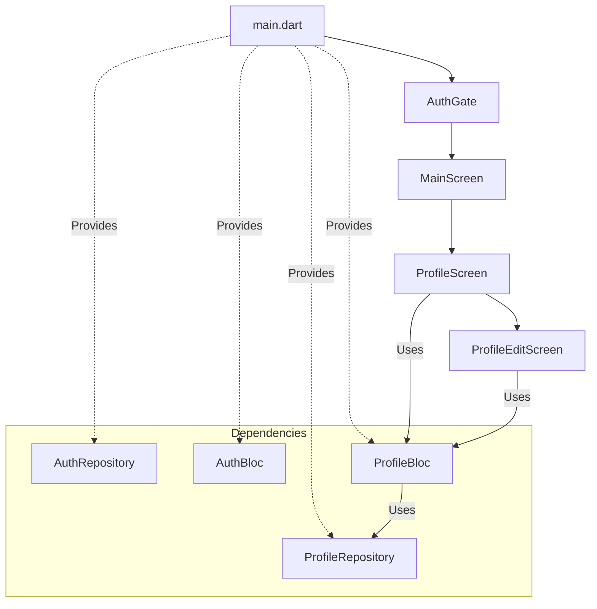

# Profile Feature Architecture Diagram

## System Overview



## Profile Screen Flow



## Profile Edit Flow



## Authentication & Profile Creation Flow



## Clean Architecture Layers



## State Management Flow



## Database Schema



## Security Model



## Component Dependencies



## File Structure

```
lib/features/profile/
│
├── domain/                     # Business Logic Layer
│   ├── entities/
│   │   └── user_profile.dart   # Core entity (no dependencies)
│   └── repositories/
│       └── profile_repository.dart  # Interface (depends on entities)
│
├── data/                       # Data Layer
│   ├── models/
│   │   └── user_profile_model.dart  # Model (extends entity)
│   └── repositories/
│       └── profile_repository_impl.dart  # Implementation
│
└── presentation/               # Presentation Layer
    ├── bloc/
    │   ├── profile_bloc.dart   # State manager
    │   ├── events/
    │   │   └── profile_event.dart
    │   └── states/
    │       └── profile_state.dart
    └── screens/
        ├── profile_screen.dart      # View profile
        └── profile_edit_screen.dart # Edit profile
```

## Key Design Patterns

1. **Repository Pattern**: Abstracts data sources
2. **BLoC Pattern**: Separates business logic from UI
3. **Dependency Injection**: Loose coupling via providers
4. **Factory Pattern**: Model creation from JSON
5. **Observer Pattern**: State changes notify UI
6. **Strategy Pattern**: Different authentication methods

---

These diagrams provide a visual understanding of how the profile feature is architected and how different components interact with each other.
